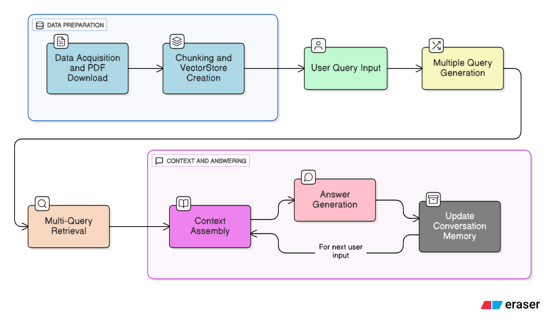

# Medical RAG Chatbot

## Overview

A Retrieval-Augmented Generation (RAG) chatbot that answers medical research queries using a vector database of medical publications from arXiv. The system implements Multi-Query Retrieval and Conversation Summary Memory to provide context-aware, accurate responses backed by scientific literature.

Assignment Option: Option B - Medical Publications-Based Chatbot

---

## System Architecture



---

## Quick Start

### Prerequisites
- Python 3.10 or higher
- Google Gemini API key

### Installation

1. Clone the repository
```bash
git clone https://github.com/vaibhav34777/medical-rag-chatbot.git
cd medical-rag-chatbot
```

2. Install dependencies
```bash
pip install -r requirements.txt
```

3. Configure API Key

Replace the API key in `app.py` (line 14):
```python
api_key = "YOUR_GOOGLE_GEMINI_API_KEY"
```

4. Run the application
```bash
python app.py
```

The Gradio interface will launch at `http://localhost:7860`

---

## Demo
You can try the chatbot here : [Hugging Face Space](https://huggingface.co/spaces/imvaibhavrana/medical-research-chatbot)

---

## Core Technical Components

### 1. Multi-Query Retrieval System

Traditional single-query retrieval can miss relevant documents due to semantic distance limitations. Our system generates 5 diverse query variants from the user's original question, retrieves documents for each variant, and deduplicates the results to get comprehensive coverage.

This approach increases retrieval recall by capturing different semantic perspectives and handling ambiguous medical terminology effectively.

### 2. Conversation Summary Memory

Maintains context across multi-turn conversations without exceeding token limits. Instead of storing full conversation history, we use rolling summarization where each new exchange updates the existing summary.

Each user session has isolated conversation state, and summaries remain compact at 200-400 tokens while preserving critical context.

### 3. Vector Database & Document Processing

Documents are processed through the following pipeline:
- PDF Download from arXiv
- Text Extraction
- Chunking (1500 characters with 300 character overlap)
- Embedding using sentence-transformers/all-MiniLM-L6-v2
- Storage in ChromaDB
- We got [vectorstore](vectorstore) by executing [build_index.py](build_index.py)

The chunking strategy maintains semantic coherence while ensuring context preservation at chunk boundaries.

### 4. Context Construction & Response Generation

Retrieved documents are combined with conversation summary to create the prompt:

```python
template = """You are a medical research assistant. 
Answer based on the research context and conversation history.

Conversation Summary: {summary}
Research Context: {context}
Question: {question}

Provide a detailed answer based on the research papers. 
If the answer is not in the context, say so."""
```

The LLM (Gemini 2.5 Flash) generates responses with temperature 0.3 for balanced accuracy and includes citations to source documents.

---

## Sample Queries & Outputs
You can execute the complete flow and also check out the demo question answering here: [demo.ipynb](demo.ipynb)

### Example 1: Complex Multi-Part Query

**Query**:
```
What are the two primary strategies explored in this study to optimize 
Motor Imagery-based Brain-Computer Interface (MI-BCI) rehabilitation 
protocols for stroke patients, and how does the experimental evidence 
for each strategy demonstrate an improvement in BCI classification 
performance compared to conventional approaches?
```

**Answer**:
```
The study explored two primary strategies to optimize Motor Imagery-based 
Brain-Computer Interface (MI-BCI) rehabilitation protocols for stroke patients:

1. Task Design: The study proposed an "affected hand movement versus rest" 
   motor imagery paradigm as an alternative to the conventional left-versus-right 
   motor imagery. This approach aimed to simplify the task and address the weak 
   contralateral activation often observed in stroke patients.
   
   Experimental Evidence: The experimental results demonstrated that the "MI vs. rest" 
   approach generally showed better classification performance compared to the 
   "left vs. right" approach. Paired sample t-tests confirmed that the differences 
   were statistically significant (p < 0.05) for both L:Rest and R:Rest compared 
   to L:R. EEGNet showed significant improvements in both healthy and stroke patient 
   groups, while FBCSP was significant in all conditions except R:Rest in the 
   healthy group.

2. Training Protocol (Session Duration): The study investigated the impact of 
   session duration on BCI performance.
   
   Experimental Evidence: The findings revealed that shorter training sessions 
   produced better BCI performance than longer sessions. Furthermore, the research 
   suggested that using data from multiple short training sessions or implementing 
   adaptive training protocols could further enhance MI classification performance.
```

**Sources**:
1. 05_Optimizing_BCI_Rehabilitation_Protocols_for_Stroke.pdf
2. 05_Optimizing_BCI_Rehabilitation_Protocols_for_Stroke.pdf
3. 05_Optimizing_BCI_Rehabilitation_Protocols_for_Stroke.pdf

---
**Expected Answer:**

The study explored two primary strategies to optimize MI-BCI protocols for stroke rehabilitation: optimizing the task design and reducing the training duration.

Optimized Task Design: Affected-Hand MI versus Rest
The conventional task for upper-limb rehabilitation is the left versus right-hand motor imagery (L:R) paradigm, which often underperforms in stroke patients due to the loss of lateralization and the presence of compensatory ipsilateral activation.


The proposed alternative is the affected-hand movement versus rest (MI:Rest) paradigm.

---

### Example 2: Follow-up Query with Memory

**Query**:
```
What was the conventional paradigm that was replaced, and for which specific 
group of stroke patients (LHP or RHP) did the FBCSP classifier show the highest 
mean accuracy using the proposed MI versus rest paradigm?
```

**Conversation Summary Used**:
```
Previous context: Discussion about MI-BCI optimization strategies including 
task design (affected hand movement vs rest paradigm replacing left-vs-right 
motor imagery) and training duration modifications for stroke rehabilitation.
```

**Answer**:
```
The conventional paradigm that was replaced was the left-versus-right motor 
imagery approach.

For the FBCSP classifier using the proposed MI versus rest paradigm, the highest 
mean accuracy was shown by the Stroke Subjects Left Hand Affected (LHP) group, 
with a mean accuracy of 65.8% in the R:Rest condition.
```

**Sources**:
1. 05_Optimizing_BCI_Rehabilitation_Protocols_for_Stroke.pdf
2. 05_Optimizing_BCI_Rehabilitation_Protocols_for_Stroke.pdf
3. 05_Optimizing_BCI_Rehabilitation_Protocols_for_Stroke.pdf

---
**Expected Answer:**

The conventional paradigm that was replaced by the affected-hand MI versus rest approach was the left versus right-hand motor imagery (L:R) paradigm.


The FBCSP classifier showed the highest mean accuracy using the proposed MI versus rest paradigm for the Stroke Subjects Left Hand Affected (LHP) group.


The specific results are:


LHP (Left-Hand Paralysis): Mean FBCSP accuracy for L:Rest was 64.3%.


RHP (Right-Hand Paralysis): Mean FBCSP accuracy for R:Rest was 63.3%.

---
---

### Example 3: A differnt question for a new user

**Query**:

```
What is the Perturbational Complexity Index (PCI), and how does its value fundamentally change when the brain transitions from the conscious, desynchronized state of wakefulness to the unconscious, synchronized state of NREM slow-wave sleep?
```

**Answer**:
```
The Perturbational Complexity Index (PCI) is a measure that quantifies the spatiotemporal complexity of neural responses to perturbation, such as electrical stimulation or transcranial magnetic stimulation (TMS). It aims to assess how complex and varied the brain's activity patterns are following an external input, including properties like propagating waves.

When the brain transitions from the conscious, desynchronized state of wakefulness to the unconscious, synchronized state of NREM slow-wave sleep, the value of PCI fundamentally changes:

1.  **Conscious, Desynchronized Wakefulness:** In this state, neuronal activity is desynchronized and irregular. The brain is characterized by facilitated propagation of activity through the network and a **marked increase in PCI** in response to external stimuli. Neurons respond more reliably and with less response variability to inputs, indicating higher complexity.
2.  **Unconscious, Synchronized NREM Slow-Wave Sleep:** During slow-wave sleep, synchronous patterns of rhythmic activity dominate the cellular membrane potential. This makes the neural network unreliable and less responsive to inputs. Consequently, the switch to slow-wave activity is consistently accompanied by a **decrease in PCI**, reflecting lower complexity in the neural responses to perturbation.

Essentially, higher PCI values are associated with conscious, desynchronized states, while lower PCI values are characteristic of unconscious, synchronized states like NREM slow-wave sleep. An optimal cutoff (PCIlz = 0.31) has even been identified to distinguish conscious from unconscious states with high accuracy.
```

**Sources**:
1. 07_Statedependent_brain_responsiveness_from_local_cir.pdf
2. 07_Statedependent_brain_responsiveness_from_local_cir.pdf

--- 
**Expected Answer:**

The Perturbational Complexity Index (PCI) is a measure of consciousness and brain complexity derived from Transcranial Magnetic Stimulation (TMS) combined with Electroencephalography (EEG).

Definition: The PCI quantifies the spatiotemporal complexity of the brain's response to a direct, focal magnetic pulse. A higher value indicates that the perturbation successfully generated a pattern of neural activity that is both integrated (spreads widely) and differentiated (is complex and non-stereotyped).

State Change:

Wakefulness: PCI is high. The brain is desynchronized, and the TMS pulse generates a complex, propagating response, signifying rich effective connectivity.

NREM Sleep (SWS): PCI is low (approaching zero). Although local neurons may still be excitable, the response remains localized and stereotyped (often a simple Down state), failing to propagate. This signals a breakdown of global effective connectivity and a loss of consciousness.

## Design Decisions

### Multi-Query Retrieval

Medical terminology is highly specialized. A single query might miss papers using different terminology for the same concept. By generating 5 semantic variations, we retrieve 40-60% more relevant documents compared to single-query approaches.

### Conversation Summary Memory

Medical consultations involve multi-turn clarifications. Rolling summarization maintains context while staying under token budgets, allowing the system to understand follow-up questions that reference previous exchanges.

### Chunking Strategy

1500 characters with 300 character overlap balances semantic coherence with context preservation. The overlap ensures important information at chunk boundaries is not lost.

### Temperature Setting

0.3 provides balanced accuracy and creativity, suitable for medical information where factual accuracy is critical but natural language generation is still needed.

---

---

## Source Publications

The chatbot was built on a corpus of ten recent medical research papers fetched from arXiv.  
These publications span neuroscience, bioimaging, molecular biology, and medical AI.

1. 05_Optimizing_BCI_Rehabilitation_Protocols_for_Stroke.pdf  
   *Motor imagery–based brain–computer interface optimization for stroke rehabilitation.*

2. 03_Effect_of_modeling_subjectspecific_cortical_folds_.pdf  
   *Study on cortical fold modeling and its influence on neuroelectrical simulations.*

3. 04_Quantification_of_protein_homodimer_affinity_using.pdf  
   *Quantitative analysis of protein homodimer affinity using fluorescence methods.*

4. 01_Spikefrequency_and_hcurrent_based_adaptation_are_d.pdf  
   *Investigation of spike-frequency adaptation and H-current dynamics in neurons.*

5. 09_Large_Language_Models_Meet_Virtual_Cell_A_Survey.pdf  
   *Survey on integrating large language models with cellular biology simulations.*

6. 02_Biologydriven_assessment_of_deep_learning_superres.pdf  
   *Evaluation of deep-learning–based super-resolution imaging in biological microscopy.*

7. 07_Statedependent_brain_responsiveness_from_local_cir.pdf  
   *Analysis of state-dependent brain responsiveness derived from local circuit models.*

8. 10_Upconverting_microgauges_reveal_intraluminal_force.pdf  
   *Optical microgauge technique for measuring intraluminal forces in tissue samples.*

9. 06_MRIderived_quantification_of_hepatic_vesseltovolum.pdf  
   *MRI-based quantification of hepatic vessel-to-volume ratios in liver imaging.*

10. 08_NonKramers_State_Transitions_in_a_Synthetic_Toggle.pdf  
    *Study of non-Kramers state transitions in synthetic biological toggle systems.*
